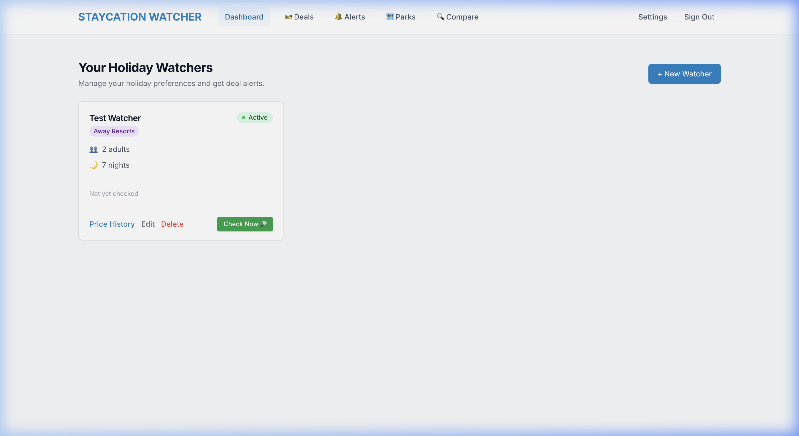
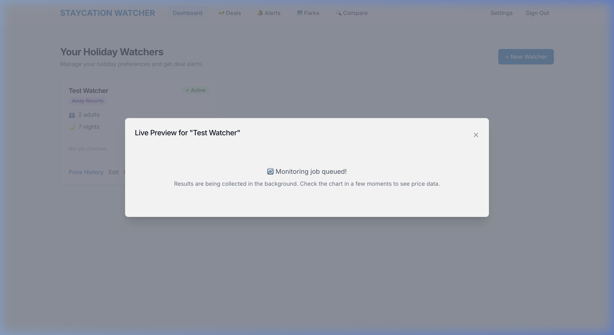
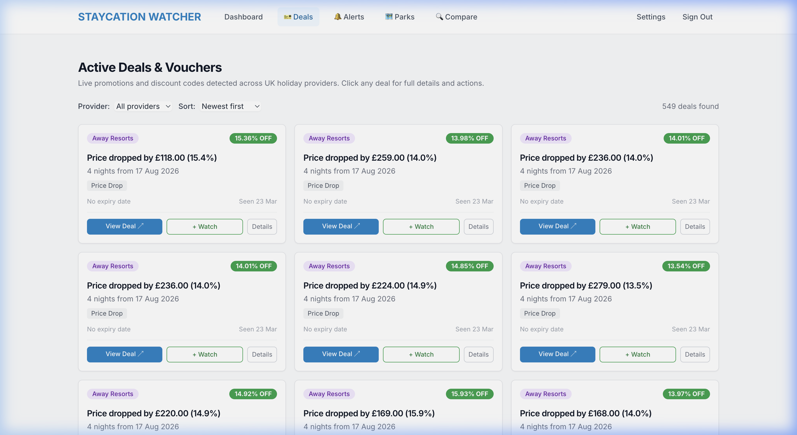
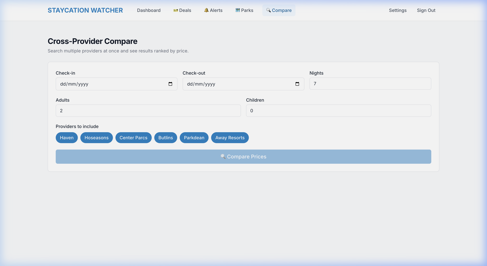
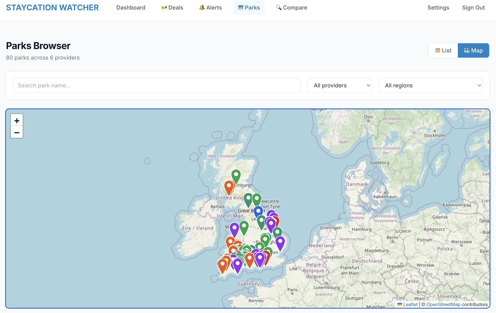

# UK Staycation Price & Deal Watcher

A personal assistant that monitors UK staycation prices and deals over time, alerting you only when booking conditions are meaningfully good.

## Key Features

- 🔍 **Real-time Price Watchers**: Create specific watchers to monitor prices for particular parks, dates, and guest configurations.
- 📊 **Historical Tracking**: Build a comprehensive price history to identify genuine deals and avoid "fake" discounts.
- 🎯 **Smart Alerts**: Get notified via email (AWS SES) only when prices hit meaningful thresholds or significant drops occur.
- 🏷️ **Active Deals & Vouchers**: A dedicated aggregator for the latest price drops and discount codes across multiple providers.
- 🗺️ **Interactive Parks Browser**: Explore over 80 holiday parks across 6 providers using a beautiful interactive map.
- 🔄 **Cross-Provider Comparison**: Simultaneously search and compare prices across Haven, Hoseasons, Center Parcs, Butlins, Parkdean, and Away Resorts.
- ⚡ **Live Monitoring**: Trigger on-demand price checks to get the most up-to-date availability and pricing instantly.
- 🔐 **Secure & Private**: Full authentication system with email verification and secure password management.

## Visual Tour

### Dashboard & Monitoring
Manage your holiday watchers and trigger real-time price checks to stay ahead of the curves.



### Deals & Comparisons
Discover the best promotions and compare multiple providers in a single view.



### Parks Exploration
Find your perfect destination with our interactive map of across all supported holiday providers.


## Quick Start

### Prerequisites

- Docker and Docker Compose
- Node.js 20+ (for local development)
- AWS SES credentials (optional, for email notifications)

### Installation

1. **Clone the repository**
   ```bash
   cd /Users/jamescregeen/MyStaycation/MyStaycation
   ```

2. **Create environment file**
   ```bash
   cp .env.example .env
   ```

3. **Edit `.env` and configure**:
   - Set a strong `JWT_SECRET` (minimum 32 characters)
   - Configure AWS SES credentials (or use SMTP)
   - Adjust scraping kill switches as needed
   - Set provider enable/disable flags

4. **Start the application**
   
   **Development mode** (no nginx):
   ```bash
   ./start.sh
   # or
   docker-compose --profile dev up -d
   ```
   
   **Production mode** (with nginx):
   ```bash
   ./start-prod.sh
   # or
   docker-compose --profile prod up -d
   ```

5. **Run database seeds**
   ```bash
   docker-compose exec api npm run seed
   ```

6. **Access the application**
   - Dev mode: http://localhost:3000 (direct), http://localhost:4000 (API)
   - Prod mode: http://localhost (via nginx)
   - Health check: http://localhost:4000/health

## Architecture

- **Backend**: Node.js/TypeScript with Fastify
- **Database**: PostgreSQL with TypeORM
- **Queue**: Redis + BullMQ for background jobs (scraping, emails)
- **Frontend**: Next.js (React/TypeScript) with modern, responsive UI
- **Proxy**: Nginx with rate limiting and security headers

## Scraping Kill Switches

Control scraping behavior via environment variables without code changes:

```bash
# Global kill switch
SCRAPING_ENABLED=false  # Disables all scraping

# Provider-specific switches
PROVIDER_HOSEASONS_ENABLED=false  # Disable Hoseasons only
PROVIDER_HAVEN_ENABLED=false      # Disable Haven only

# Playwright control
PLAYWRIGHT_ENABLED=false      # Disable browser-based scraping
PLAYWRIGHT_CONCURRENCY=1      # Limit concurrent browser instances
```

## Documentation

📚 **Complete documentation is available in the [`docs/`](docs/) directory**

### Quick Links
- [📖 Full Documentation Index](docs/README.md) - Complete documentation overview
- [🚀 Deployment Guide](docs/deployment/DEPLOYMENT.md) - Production deployment instructions
- [🏗️ Architecture & Requirements](docs/architecture/REQUIREMENTS.md) - System requirements and design
- [👨‍💻 Provider Guide](docs/development/PROVIDER_GUIDE.md) - Adding new holiday providers
- [✅ Project Status](docs/status/FIXES_COMPLETED.md) - Current completion status
- [🔧 API Reference](docs/SEARCH_PREVIEW_API.md) - API endpoints and usage

## Security & Compliance

- ✅ JWT authentication & bcrypt password hashing
- ✅ Rate limiting & CORS protection
- ✅ Security headers via Helmet.js
- ✅ Respects robots.txt and identifies with User-Agent
- ✅ Uses respectful scraping intervals (24-72h)
- ✅ Logs all search operations for audit trail

## License

GNU Affero General Public License v3.0 - see [LICENSE](LICENSE) file
