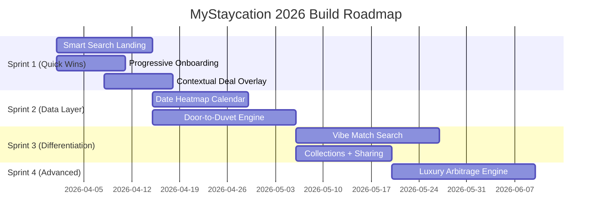
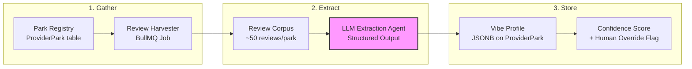
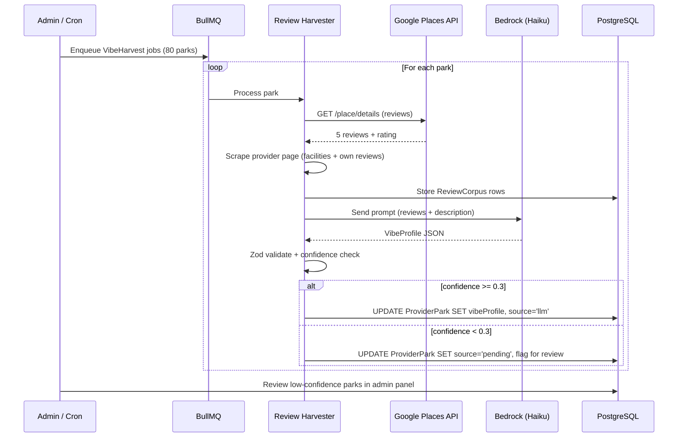
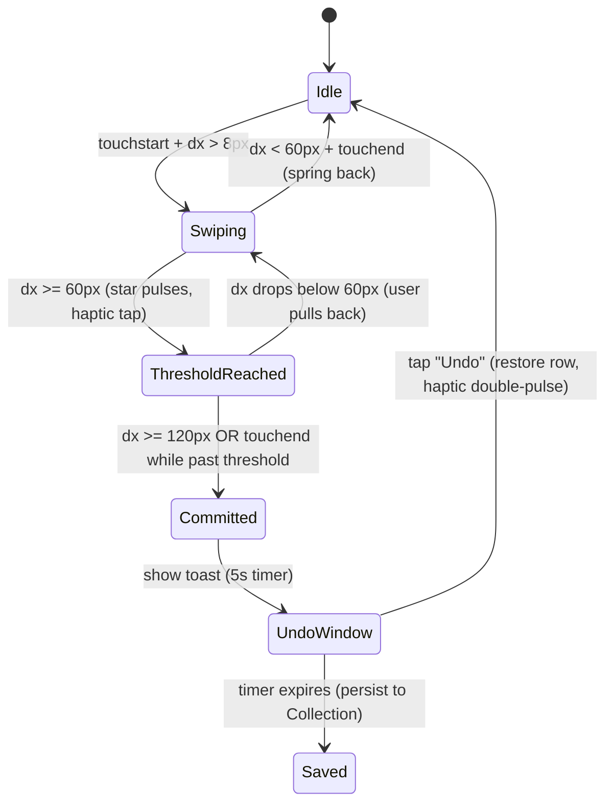

# MyStaycation 2026 Strategy: Search & Discovery Evolution

**Author:** Senior UX Architect & Product Lead Review  
**Date:** 2026-03-24  
**Scope:** 5 High-Impact Improvements + 3 Unique Features  
**Lens:** Search & Discovery (User-Centric)

---

## Design Philosophy

| Surface | Principle | What it Means in Practice |
|---|---|---|
| **Mobile / Tablet** | **Thumb-First** | All primary actions sit in the lower 40% of the viewport. Filters open as bottom-sheets, not modals. Swipe-to-dismiss replaces close buttons. FABs for "Search" / "Watch". |
| **Desktop** | **Functional Minimalism** | Two-column master–detail. Left rail = filters + watchlist. Right pane = results + map. Zero decorative chrome; hierarchy communicated through spacing & type weight alone. |

---

## Part A: 5 High-Impact Improvements

> Ranked by **Value to User ÷ Complexity to Build** (highest first).

---

### 1. 🔍 Unified "Smart Search" Landing — *One Box to Rule Them All*

**Rank:** ⭐⭐⭐⭐⭐ Value · ⭐⭐ Complexity

#### What it is
Replace the current flow of *"register → create profile → wait for scrape"* with a single, universal search input on the homepage that delivers live cross-provider results in < 15 seconds — no account required. Users who want persistent monitoring can then save the search as a watched profile.

#### User Story
> *As a first-time visitor, I want to type "Lake District, 4 nights, August, 2 adults, dog-friendly" into one search bar and see ranked results from every provider so I can immediately compare prices without creating an account.*

#### Functional Specification

| Aspect | Detail |
|---|---|
| **Entry point** | Replace the hero CTA on `page.tsx` with a prominent `<SmartSearchBar>` — a single auto-completing text input + inline filter chips (dates, party size, pets, property type). |
| **Mobile (Thumb-First)** | Search bar pinned to bottom-sheet trigger; tapping expands a half-sheet with stacked chips for each filter. Confirm with a large "Search" button at very bottom of sheet. |
| **Desktop (Functional Minimalism)** | Full-width input with inline chips, à la Google Flights. Filters appear as compact dropdowns on the same horizontal line. |
| **Backend** | Re-use existing `POST /search/preview` with `INLINE_PROFILE` mode. No new endpoint needed — just a new anonymous-accessible variant with rate-limiting (e.g. 3 searches/hour for unauthenticated). |
| **Results** | Render in the same `ComparisonTable.tsx` component, sorted by `pricePerNightGbp`. Each result row shows: provider logo, park name, price (total + per night), dates, and a "Watch this" CTA that prompts sign-up/login. |
| **Conversion hook** | Beneath results: "Save this search — we'll alert you when prices drop." → auth gate. |

**Technical Requirements:**
- [ ] New `<SmartSearchBar>` component with debounced input + Zod-validated filter state
- [ ] Anonymous rate-limited route wrapper on `/search/preview`
- [ ] Landing page redesign (`page.tsx`) to embed search above fold
- [ ] Progressive auth gate: show results first, gate on "Watch"

---

### 2. 📅 Visual Date Flexibility Heatmap — *"When Should I Go?"*

**Rank:** ⭐⭐⭐⭐⭐ Value · ⭐⭐⭐ Complexity

#### What it is
A colour-coded calendar heatmap that shows price intensity across a flexible date window. Instead of searching one date at a time, users see 3–4 months of pricing at a glance — green cells are cheap, red cells are expensive.

#### User Story
> *As a flexible traveller, I want to see a colour-coded monthly view of prices for my chosen park so I can pick the cheapest arrival date in one glance without running multiple searches.*

#### Functional Specification

| Aspect | Detail |
|---|---|
| **Trigger** | When `flexType=FLEXI` or `flexType=RANGE` and the range spans ≥ 14 days, the profile detail page renders a `<PriceHeatmapCalendar>` instead of (or alongside) the existing `PriceChart.tsx` line graph. |
| **Rendering** | Calendar grid (Mon–Sun columns). Each cell = one possible arrival date. Cell colour = normalised `pricePerNightGbp` on a 5-step scale (forest green → amber → crimson). Tapping a cell shows a tooltip with exact price, provider, and "Book" link. |
| **Mobile (Thumb-First)** | Horizontal scrolling month strips. Current month visible by default. Swipe left/right for adjacent months. Tap-and-hold for tooltip. |
| **Desktop (Functional Minimalism)** | 4 months rendered in a 2×2 grid. Hover for tooltip. Click to drill into that date's full results. |
| **Data source** | Aggregate from `price_observations` by `stayStartDate` grouping. The data already exists — this is purely a visualisation layer over the prices the system is already collecting. |

**Technical Requirements:**
- [ ] New `<PriceHeatmapCalendar>` React component (CSS Grid or `react-calendar-heatmap`)
- [ ] Backend: new `GET /insights/heatmap?profileId=X&from=&to=` aggregation query (min price per arrival date)
- [ ] Colour scale tokens in design system (5-step green → red, with accessible contrast)
- [ ] Touch: swipe + tap-and-hold; Desktop: hover tooltip

---

### 3. 🏷️ Contextual Deal Overlay on Results — *"Is This Actually a Deal?"*

**Rank:** ⭐⭐⭐⭐ Value · ⭐⭐ Complexity

#### What it is
Every price shown anywhere in the app (search results, comparison table, profile detail) gets an inline deal-truth badge: a small tag showing whether this price is genuinely good vs. historically average. Derived from existing `Insight` data.

#### User Story
> *As a value-conscious booker, I want to see at a glance whether the price I'm looking at is genuinely good, average, or inflated compared to historical data, so I don't fall for fake "sale" marketing.*

#### Functional Specification

| Aspect | Detail |
|---|---|
| **Badge types** | 🟢 **Best Price** (LOWEST_IN_X_DAYS) · 🟡 **Fair Price** (within 10% of 30-day mean) · 🔴 **Above Average** (> 10% above 30-day mean) · 🏷️ **Voucher Available** (VOUCHER_SPOTTED) |
| **Placement** | Inline next to every `£XXX` price display. On mobile: small pill badge below the price. On desktop: inline right of the price with a subtle info icon for details. |
| **Data source** | Join against `insights` table for the matching `seriesKey`. If no insight data exists (new property), show a neutral ⚪ "Not enough data" badge. |
| **Interaction** | Tapping/hovering the badge expands a micro-popover: "This price is the lowest we've seen in 47 days" or "This price is 12% above the 30-day average of £X". |

**Technical Requirements:**
- [ ] New `<DealBadge>` shared component; consumed by `ComparisonTable`, `ResultsModal`, `ProfileList`
- [ ] Backend: extend search result payloads with `priceContext: { badge, percentile, avgPrice30d }` — computed from existing `PriceObservation` data
- [ ] Update `search.ts` response shape to include `priceContext` field

---

### 4. 🗂️ Saved Searches as "Collections" with Sharing — *"Our Family Holiday Shortlist"*

**Rank:** ⭐⭐⭐⭐ Value · ⭐⭐⭐ Complexity

#### What it is
Allow users to group profiles and comparison results into named "collections" (e.g., "Summer 2026 Options") and share them via a read-only link. Partners, friends, and family can view the collection — prices, charts, deal badges — without needing an account.

#### User Story
> *As a parent planning a family trip, I want to create a shortlist of holiday options and share a link with my partner so we can collaboratively decide which one to book.*

#### Functional Specification

| Aspect | Detail |
|---|---|
| **Create** | New "Add to Collection" button on each profile card and each comparison result row. Creates or appends to a named collection stored on the user. |
| **View** | `/dashboard/collections/[id]` — grid of cards showing park/property name, provider, price, deal badge, and mini sparkline of price trend. |
| **Share** | "Share" button generates a signed, read-only URL (`/shared/[token]`) valid for 30 days. No login required to view. |
| **Mobile (Thumb-First)** | Collection view is a vertically scrolling card stack. Share via native `navigator.share()` API for WhatsApp/iMessage integration. |
| **Desktop (Functional Minimalism)** | Side-by-side card grid (3 columns). Copy-link button with visual confirmation. |

**Technical Requirements:**
- [ ] New `Collection` entity (name, userId, createdAt, shareToken, expiresAt)
- [ ] New `CollectionItem` join entity (collectionId, profileId or snapshotData)
- [ ] New routes: `POST /collections`, `GET /collections/:id`, `POST /collections/:id/share`
- [ ] Public read-only route: `GET /shared/:token` (no auth)
- [ ] Frontend: `CollectionPage`, `CollectionCard`, `ShareButton` components

---

### 5. 📱 Progressive Onboarding Wizard — *"You Had Me at 'Hello'"*

**Rank:** ⭐⭐⭐ Value · ⭐ Complexity

#### What it is
Replace the current "blank dashboard → create profile via complex form" experience with a 3-step conversational wizard that asks plain-English questions and builds the `HolidayProfile` behind the scenes.

#### User Story
> *As a new user, I want to answer 3 simple questions — "Where?", "When?", "Who?" — and have a watcher created for me automatically so I don't have to understand accommodation types, flex settings, and stay patterns.*

#### Functional Specification

| Step | Question (Mobile) | Maps to |
|---|---|---|
| 1 | "Where do you fancy?" → Region cards with photos (Cornwall, Lake District, etc.) or "Anywhere" | `region`, `parkIds` |
| 2 | "When works for you?" → Tap month bubbles or "I'm flexible" | `dateStart`, `dateEnd`, `flexType` |
| 3 | "Who's coming?" → Stepper inputs for adults, children, pets | `partySizeAdults`, `partySizeChildren`, `pets` |
| Auto | System selects sensible defaults for everything else | `durationNightsMin/Max=3-7`, `accommodationType=ANY`, `tier=STANDARD`, `alertSensitivity=INSTANT` |
| Result | "Your watcher is live! Here are today's best prices:" → preview results + "Customise" link to full form. |

| Surface | UX Notes |
|---|---|
| **Mobile** | Full-screen step cards with large touch targets. Swipe or "Next" FAB at bottom. Progress dots at top. |
| **Desktop** | Single-page horizontal stepper in the centre column. Each step expands inline. |

**Technical Requirements:**
- [ ] New `<OnboardingWizard>` component with 3 step views
- [ ] Smart defaults engine: map selected region to recommended providers, set duration range to `3-7`, default `accommodationType=ANY`
- [ ] Auto-trigger `POST /search/preview` on completion for instant gratification
- [ ] A/B testable: feature-flag to show wizard vs. current form for new signups

---

## Part B: 3 Unique Features

> These target 2026 UK travel macro-trends and represent differentiated, potentially first-to-market capabilities.

---

### 🚀 UNIQUE FEATURE 1: "Door-to-Duvet" Total Trip Cost Transparency

**Trend Addressed:** *Door-to-Duvet Logistics* — UK holidaymakers in 2026 increasingly evaluate total trip cost (fuel, tolls, food shops, activities), not just accommodation price. No UK staycation platform currently aggregates these.

**🏆 First-to-Market Claim:** No existing UK holiday comparison tool shows the total door-to-duvet cost from the user's home to the park and back, inclusive of accommodation, fuel, and on-park spending estimates. This is the first holistic "true cost" engine for the UK staycation market.

#### What it is
An extension to every search result and profile that calculates and displays the **estimated total trip cost**, including:
1. **Accommodation** (the price already tracked)
2. **Travel cost** (fuel estimate based on user's home postcode → park lat/long, pence-per-mile at current UK fuel rates)
3. **Travel time** (driving duration estimate via free routing APIs)
4. **On-park spending estimate** (crowd-sourced median weekly spend per provider, e.g. "Haven families typically spend £150–250 on food & activities on park")

#### User Story
> *As a budget-planning parent, I want to see the full "door-to-duvet" cost of each option — including petrol from my house and expected spending at the park — so I can compare total holiday cost, not just the listing price.*

#### Functional Specification

##### Mobile (Thumb-First)
```
┌─────────────────────────────────────┐
│  Haven · Hafan y Môr, Pwllheli       │
│  ────────────────────────────────── │
│  🏠 Accommodation     £649          │
│  🚗 Travel (267 mi)   £78  · 4h 20m│
│  🍕 On-Park Est.      £180 – £250  │
│  ──────────────────────────────────  │
│  💰 TOTAL TRIP COST   £907 – £977  │
│  🟢 Best Price in 30 days           │
│                                     │
│  [ Watch This ] [ View Breakdown → ]│
└─────────────────────────────────────┘
```
- Cost breakdown is collapsed by default; tap "View Breakdown" to expand.
- Travel section tappable → opens directions in Apple/Google Maps.

##### Desktop (Functional Minimalism)
- Additional columns in `ComparisonTable`: "Travel", "On-Park Est.", "Total" alongside the existing "Price" column.
- Users set their home postcode once in Settings → persisted on `User` entity.
- Sortable by Total Trip Cost (default) or just Accommodation.

##### Data Sources & APIs

| Data Point | Source | Cost |
|---|---|---|
| Driving distance & time | OSRM (self-hosted, free) or Mapbox Directions API (free tier: 100K req/month) | Free / low |
| Fuel cost per mile | Open API from RAC/AA or static config updated monthly | Free |
| On-park spending estimate | Seed from TripAdvisor/MoneySavingExpert crowd data; refine over time via optional user-submitted spend tracking | Free |
| User home postcode | User-provided in settings; geocode via `postcodes.io` (free, UK-specific) | Free |

#### Technical Requirements
- [ ] New `homePostcode` and `homeLatLng` fields on `User` entity
- [ ] Settings page: postcode input with `postcodes.io` validation & geocoding
- [ ] New `TripCostService` in backend (`services/trip-cost.service.ts`):
  - Accepts: origin lat/lng, destination lat/lng, stayNights, providerKey
  - Returns: `{ distanceMiles, drivingMinutes, fuelCostGbp, onParkEstLow, onParkEstHigh, totalLow, totalHigh }`
- [ ] OSRM integration or Mapbox Directions client for driving distance/time
- [ ] On-park spend config: JSON seed file per provider with `{ weeklySpendLow, weeklySpendHigh }`, admin-editable
- [ ] Extend search result response with `tripCost` object
- [ ] New `<TripCostBreakdown>` UI component for result cards
- [ ] "Sort by Total Trip Cost" option in comparison views

---

### 🚀 UNIQUE FEATURE 2: "Vibe Match" — Semantic Discovery Beyond Geography

**Trend Addressed:** *Semantic Vibe-Matching* — Users in 2026 increasingly search by *feeling* ("quiet retreat", "adventure with kids", "romantic lodge") rather than geographic filters. This moves search from WHERE to WHAT-IT-FEELS-LIKE.

#### What it is
A search mode where users describe the *experience* they want in natural language, and the system matches parks based on semantic attributes (amenities, reviews sentiment, location character, activity density) rather than just location+dates.

Instead of: "Devon → Lodges → 4 nights"  
The user says: "A quiet, dog-friendly escape near the coast with a hot tub and good walking trails."

#### User Story
> *As someone who cares more about the experience than the specific location, I want to describe the kind of holiday I'm imagining and see parks ranked by how well they match that vibe, even across different providers and regions.*

#### Functional Specification

##### Vibe Taxonomy (Structured Tags per Park)
Rather than relying on a large language model at query time, the system pre-computes a **Vibe Profile** for each `ProviderPark` based on known attributes:

| Vibe Dimension | Source Data | Example Values |
|---|---|---|
| **Pace** | Facility count, entertainment schedule density | `Quiet` · `Balanced` · `Buzzy` |
| **Terrain** | Park region, coastal/inland flag, nearby AONB | `Coastal` · `Woodland` · `Countryside` · `Lakeside` |
| **Best For** | Accommodation types, activity range, accessibility | `Couples` · `Young Families` · `Dog Owners` · `Groups` |
| **Standout Amenities** | Scraped facility lists | `Hot Tub` · `Swimming Pool` · `Spa` · `Water Sports` · `Nature Trails` |
| **Price Bracket** | Median observed price per night | `Budget` · `Mid-Range` · `Premium` |

##### Mobile (Thumb-First)
```
┌─────────────────────────────────────┐
│  ✨ How do you want to feel?        │
│                                     │
│  [ 🌊 Coastal Escape ]              │
│  [ 🌲 Woodland Retreat ]            │
│  [ 🎉 Action-Packed ]               │
│  [ 🐕 Dog's Paradise ]              │
│  [ 💆 Spa & Relaxation ]            │
│  [ 🏔️ Wild & Remote ]               │
│                                     │
│  ── or describe it ──               │
│  ┌─────────────────────────────┐    │
│  │ "Quiet lodge, hot tub, near │    │
│  │  the sea, ok for dogs"     │    │
│  └─────────────────────────────┘    │
│                                     │
│         [ Find My Vibe ]            │
└─────────────────────────────────────┘
```
- Pre-set vibe tiles for one-tap discovery (bottom-sheet of quick-pick cards)
- Free-text input for advanced queries

##### Desktop (Functional Minimalism)
- Secondary search mode tab: "Search by Dates" | "**Search by Vibe**"
- Left rail = vibe filter toggles (checkboxes for pace, terrain, amenities)
- Right pane = results grid with vibe-match score (%) per park

##### Matching Engine (No LLM Required)
1. **Parse input** → Extract keywords via simple NLP (keyword extraction / pre-defined synonym map: "quiet" → `Pace:Quiet`, "hot tub" → `Amenity:HotTub`, "near the sea" → `Terrain:Coastal`, "dogs" → `BestFor:DogOwners`)
2. **Score** → Weighted cosine similarity between user's desired vibe vector and each park's vibe profile vector. Return top N matches.
3. **Fallback** → If free-text is too vague, prompt with the tile selection.

#### Technical Requirements
- [ ] New `vibeProfile` JSONB column on `ProviderPark` entity: `{ pace, terrain, bestFor[], amenities[], priceBracket }`
- [ ] Seed script to populate vibe profiles from known park data (scraped facility pages + manual curation for top parks)
- [ ] New `VibeMatchService` in backend:
  - Input: `{ vibeQuery: string }` or `{ vibeFilters: { pace?, terrain?, bestFor?, amenities? } }`
  - Output: `ProviderPark[]` ranked by match score with availability overlay
- [ ] New route: `POST /search/vibe` — returns parks + match scores
- [ ] Keyword → vibe dimension mapping config (JSON synonym file, admin-editable)
- [ ] New `<VibeSearchPanel>` component with tile picker + free-text input
- [ ] `<VibeMatchScore>` badge component (e.g., "93% match")

---

### 🚀 UNIQUE FEATURE 3: "Shoulder Season Spotter" — Luxury Arbitrage Engine

**Trend Addressed:** *Luxury Arbitrage* — Identifying weeks where premium accommodation (Platinum lodges, spa suites, lakeside cabins) drops to near-Standard pricing due to shoulder-season demand gaps. The system turns the user's existing price data into an arbitrage radar.

#### What it is
An automated engine that continuously analyses price observations for **premium/luxury tier** accommodation and identifies "arbitrage windows" — specific date ranges where the price of a Premium/Luxury unit drops to within ≤ 15% of the Standard tier price for the same park and dates. These are surfaced as a dedicated "Luxury for Less" feed.

#### User Story
> *As a couple who'd love a premium lodge but usually can't justify the price, I want to be alerted when a luxury unit at a park I like drops to near-standard pricing during a quieter week so I can upgrade our holiday without upgrading our budget.*

#### Functional Specification

##### How Arbitrage Windows Are Detected
```
For each park P with both STANDARD and PREMIUM/LUXURY observations:
  For each overlapping date range D:
    premiumPrice = latest observation for (P, D, PREMIUM or LUXURY)
    standardPrice = latest observation for (P, D, STANDARD)
    
    If premiumPrice ≤ standardPrice × 1.15:
      → FLAG as "Luxury Arbitrage Window"
      → Calculate upliftPercent = ((premiumPrice - standardPrice) / standardPrice) × 100
      → Store as new InsightType: LUXURY_ARBITRAGE
```

##### Mobile (Thumb-First)
```
┌─────────────────────────────────────┐
│  ✨ LUXURY FOR LESS                 │
│  Premium holidays at standard prices│
│  ────────────────────────────────── │
│                                     │
│  ┌───────────────────────────────┐  │
│  │ 🏆 Center Parcs · Longleat   │  │
│  │ Executive Lodge 3-bed        │  │
│  │ 13 Oct – 17 Oct (Mon–Fri)    │  │
│  │                              │  │
│  │ Standard: £499               │  │
│  │ Premium:  £529  (+6%)        │  │
│  │ 🟢 LUXURY ARBITRAGE           │  │
│  │                              │  │
│  │ "Pay just £30 more for a     │  │
│  │  hot tub & premium furnish." │  │
│  │                              │  │
│  │ [ Watch ] [ Book → ]         │  │
│  └───────────────────────────────┘  │
│                                     │
│  ┌───────────────────────────────┐  │
│  │ 🏆 Haven · Hafan y Môr       │  │
│  │ Platinum Caravan 2-bed       │  │
│  │ 27 Oct – 31 Oct (Mon–Fri)    │  │
│  │                              │  │
│  │ Standard: £389               │  │
│  │ Platinum: £399  (+3%)        │  │
│  │ 🟢 LUXURY ARBITRAGE           │  │
│  │ ...                          │  │
│  └───────────────────────────────┘  │
└─────────────────────────────────────┘
```

- Cards are vertically scrollable.
- Clear visual hierarchy: the "uplift" percentage is the hero number.
- "Watch" creates a profile filtered to that specific premium tier + dates.

##### Desktop (Functional Minimalism)
- New `/dashboard/luxury` page or a tab within the existing Deals page.
- Table view: Park, Dates, Standard Price, Premium Price, Uplift %, Provider, Action.
- Sortable by uplift % (lowest first = best arbitrage).
- Filter by: region, provider, max budget.

##### Insight Worker Integration
The existing `insight.worker.ts` already runs per-fingerprint analysis. Extend it:
1. For each fingerprint with `tier=STANDARD`, find companion observations at the same park + dates with higher tiers.
2. Compare prices. If delta ≤ 15%, generate `LUXURY_ARBITRAGE` insight.
3. Alert worker picks these up and sends "Luxury for Less" email template.

#### Technical Requirements
- [ ] New `InsightType.LUXURY_ARBITRAGE` enum value
- [ ] Extend `insight.worker.ts` analysis loop with cross-tier comparison logic
- [ ] New `GET /insights/luxury-arbitrage` route (paginated, filterable by region/provider/maxBudget)
- [ ] `LUXURY_ARBITRAGE` insight `details` JSONB schema: `{ standardPrice, premiumPrice, upliftPercent, park, tier, stayStartDate, stayNights }`
- [ ] New email template: "Luxury for Less" alert
- [ ] New `<LuxuryArbitrageFeed>` page component
- [ ] New `<ArbitrageCard>` card component with dual-price display and uplift badge
- [ ] Seed: ensure scraping profiles exist for both STANDARD and PREMIUM tiers at overlapping parks/dates to generate the comparison data

---

## Priority Matrix

| # | Feature | Value to User | Complexity to Build | Priority Score | Category |
|---|---|---|---|---|---|
| 1 | Unified Smart Search | ⭐⭐⭐⭐⭐ | ⭐⭐ | **10** | Improvement |
| 2 | Date Flexibility Heatmap | ⭐⭐⭐⭐⭐ | ⭐⭐⭐ | **8.3** | Improvement |
| 3 | Contextual Deal Overlay | ⭐⭐⭐⭐ | ⭐⭐ | **8** | Improvement |
| U1 | Door-to-Duvet Total Cost | ⭐⭐⭐⭐⭐ | ⭐⭐⭐ | **8.3** | Unique · First-to-Market 🏆 |
| 5 | Progressive Onboarding | ⭐⭐⭐ | ⭐ | **7.5** | Improvement |
| U2 | Vibe Match Search | ⭐⭐⭐⭐ | ⭐⭐⭐ | **6.7** | Unique |
| 4 | Saved Collections + Sharing | ⭐⭐⭐⭐ | ⭐⭐⭐ | **6.7** | Improvement |
| U3 | Shoulder Season Luxury Spotter | ⭐⭐⭐⭐ | ⭐⭐⭐⭐ | **5** | Unique |

> **Priority Score** = Value (out of 5) × 2 ÷ Complexity (out of 5). Higher = do first.

---

## Recommended Build Sequence



---

## Appendix: Existing Assets Leveraged

These features are designed to maximise re-use of what's already built:

| Existing Asset | Leveraged By |
|---|---|
| `POST /search/preview` (INLINE_PROFILE mode) | Smart Search, Onboarding Wizard |
| `ComparisonTable.tsx` | Smart Search results, Door-to-Duvet display |
| `PriceObservation` table with historical data | Heatmap, Deal Overlay, Luxury Arbitrage |
| `Insight` system (5 existing types) | Deal Overlay badges, Luxury Arbitrage detection |
| `ProviderPark` with lat/long | Door-to-Duvet driving calculations, Vibe Match |
| `insight.worker.ts` analysis pipeline | Luxury Arbitrage detection (extend, not rewrite) |
| `HolidayProfile` comprehensive field set | Onboarding Wizard defaults, Collection snapshots |
| `Deal` entity with voucher codes | Deal Overlay badge system |

---

## Appendix B: LLM-Powered Vibe Profile Generation Pipeline

> How to auto-populate every `ProviderPark.vibeProfile` from real review data on Day 1, so the Vibe Match feature ships pre-loaded.

### The Problem

We have ~80+ parks across 6 providers. Manually tagging each with `pace`, `terrain`, `bestFor[]`, `amenities[]` is unsustainable and subjective. External reviews (TripAdvisor, Google) contain rich, unstructured signal that an LLM can distil into our structured vibe taxonomy.

### Architecture Overview



### Phase 1: Review Harvester

A BullMQ job (`vibe-harvest.worker.ts`) that, for each `ProviderPark`, collects review text from public sources.

#### Data Sources (in priority order)

| Source | Method | Volume Target | Rate Limits | Legal |
|---|---|---|---|---|
| **Google Places API** | Official API (`place_id` lookup → reviews) | 5 most recent reviews (API limit) | 1 req/park, free tier covers ~80 parks | ✅ API TOS compliant |
| **TripAdvisor Content API** | Official partner API (apply for key) | Up to 20 reviews per location | Requires approval; free for non-commercial | ✅ With API key |
| **Provider's own review pages** | Playwright scrape of review sections (Haven, Center Parcs publish guest reviews) | 10–30 reviews per park | Respectful intervals (re-use existing Playwright pool at `PLAYWRIGHT_CONCURRENCY=1`) | ⚠️ Same approach as existing price scraping; respects `robots.txt` |
| **Fallback: Provider descriptions** | Scrape the park's "About" / "Facilities" page | 1 page of descriptive text | Lightweight HTTP/Cheerio | ✅ |

#### Harvester Job Spec

```typescript
// jobs/workers/vibe-harvest.worker.ts

interface VibeHarvestPayload {
  parkId: string;          // ProviderPark.id
  parkName: string;
  providerKey: string;
  googlePlaceId?: string;  // Pre-mapped or auto-resolved
  tripadvisorId?: string;
}

// Output: stored in a new `park_review_corpus` table
interface ReviewCorpusRow {
  parkId: string;
  source: 'google' | 'tripadvisor' | 'provider_reviews' | 'provider_description';
  reviewText: string;      // Raw review content
  rating?: number;         // 1-5 if available
  harvestedAt: Date;
}
```

**Scheduling:** One-time bulk run at launch, then monthly refresh via cron job. Not latency-sensitive — run overnight.

**Google Place ID Resolution:**
- Use `postcodes.io` to get lat/lng from park postcode (already in your stack)
- Call Google Places Nearby Search with park name + lat/lng → resolve `place_id`
- Cache `place_id` on `ProviderPark` for future lookups

### Phase 2: LLM Extraction Agent

A service that takes the review corpus for a single park and produces a structured Vibe Profile via LLM.

#### Why an LLM (Not Keyword Matching)

| Approach | Pros | Cons |
|---|---|---|
| Keyword / regex | Fast, free, deterministic | Misses nuance ("the kids loved it" → `BestFor:YoungFamilies`), can't infer `Pace` from context |
| LLM structured output | Understands context, infers latent attributes, handles varied phrasing | Costs money, needs prompt engineering |
| **Hybrid (recommended)** | LLM does the hard inference; keyword pre-filter reduces token count | Best of both |

#### The Prompt Contract

```
SYSTEM:
You are a UK holiday park analyst. Given guest reviews for a holiday park,
extract a structured "Vibe Profile". Return ONLY valid JSON matching the
schema below. Base your assessment on the aggregate sentiment across all
reviews, not any single review.

SCHEMA:
{
  "pace": "Quiet" | "Balanced" | "Buzzy",
  "terrain": ["Coastal", "Woodland", "Countryside", "Lakeside", "Moorland"],
  "bestFor": ["Couples", "Young Families", "Teenagers", "Dog Owners",
              "Groups", "Accessibility", "Solo Travellers"],
  "amenities": string[],  // e.g. ["Hot Tub", "Swimming Pool", "Nature Trails"]
  "priceBracket": "Budget" | "Mid-Range" | "Premium",
  "vibeStatement": string, // 1-sentence marketing-quality summary, max 120 chars
  "confidence": number     // 0.0-1.0, based on review volume and consistency
}

RULES:
- "pace" should reflect the overall atmosphere, not just one reviewer's opinion.
- "terrain" is an array because a park can be both Coastal AND Woodland.
- "bestFor" should list ALL applicable audiences, not just the primary one.
- "amenities" should list only amenities explicitly mentioned by reviewers.
- "confidence" should be lower (<0.5) if fewer than 10 reviews are provided
  or if reviews are highly contradictory.

USER:
Park: "{parkName}" (Provider: {providerKey}, Region: {region})

Reviews ({count} total):
---
{concatenated review texts, truncated to ~3000 tokens}
---

Provider description:
{park description text if available}
```

#### LLM Provider Options

| Provider | Model | Cost per Park (~3K input + 500 output tokens) | 80 Parks Total |
|---|---|---|---|
| **AWS Bedrock (Claude 3 Haiku)** | `anthropic.claude-3-haiku` | ~$0.005 | **~$0.40** |
| **AWS Bedrock (Claude 3.5 Sonnet)** | `anthropic.claude-3-5-sonnet` | ~$0.03 | **~$2.40** |
| **OpenAI GPT-4o-mini** | `gpt-4o-mini` | ~$0.003 | **~$0.24** |
| **Self-hosted Llama 3** | `llama-3-8b` on EC2 | ~$0/marginal (EC2 cost) | EC2 hourly rate |

> **Recommendation:** Use **Claude 3 Haiku via Bedrock** — you already have AWS credentials for SES. Total cost for all 80 parks: under £1. Re-run monthly for ~£12/year.

#### Extraction Service

```typescript
// services/vibe-extraction.service.ts

interface VibeExtractionInput {
  parkId: string;
  parkName: string;
  providerKey: string;
  region: string;
  reviews: { text: string; rating?: number; source: string }[];
  description?: string;
}

interface VibeProfile {
  pace: 'Quiet' | 'Balanced' | 'Buzzy';
  terrain: string[];
  bestFor: string[];
  amenities: string[];
  priceBracket: 'Budget' | 'Mid-Range' | 'Premium';
  vibeStatement: string;
  confidence: number;
}

// Returns structured VibeProfile parsed from LLM JSON response
async function extractVibeProfile(input: VibeExtractionInput): Promise<VibeProfile>
```

#### Quality Guardrails

| Guardrail | Implementation |
|---|---|
| **Schema validation** | Validate LLM output with Zod against `VibeProfile` schema. Retry once on parse failure with "Fix your JSON" appended to prompt. |
| **Confidence floor** | If `confidence < 0.3` (< 5 reviews, contradictory), flag park for manual review rather than publishing. |
| **Human override** | Add `vibeProfileSource: 'llm' | 'manual' | 'hybrid'` and `vibeProfileOverride: JSONB` fields. Manual edits take precedence. Admin UI shows LLM-generated profile with "Approve / Edit" buttons. |
| **Drift detection** | Monthly re-run compares new Vibe Profile against stored. If > 2 dimensions change, flag for human review instead of auto-updating. |
| **Bias check** | Review corpus is sampled across date range (not just recent). `priceBracket` cross-referenced against actual `PriceObservation` median to prevent review-based price perception skew. |

### Phase 3: Storage & Admin

```typescript
// Updated ProviderPark entity

@Column({ type: 'jsonb', nullable: true })
vibeProfile?: VibeProfile;

@Column({ type: 'varchar', default: 'pending' })
vibeProfileSource!: 'llm' | 'manual' | 'hybrid' | 'pending';

@Column({ type: 'decimal', precision: 3, scale: 2, nullable: true })
vibeConfidence?: number;

@Column({ type: 'timestamp', nullable: true })
vibeProfileUpdatedAt?: Date;
```

**Admin panel additions:**
- Table showing all parks with vibe profiles, confidence scores, source type
- "Review & Approve" workflow for low-confidence parks
- "Re-generate" button to re-run LLM extraction for a single park
- Bulk "Generate All" action for initial population

### End-to-End Pipeline Flow



### Technical Requirements (additions to Unique Feature 2)

- [ ] New `park_review_corpus` table (parkId, source, reviewText, rating, harvestedAt)
- [ ] `vibe-harvest.worker.ts` BullMQ job + scheduler (one-time + monthly cron)
- [ ] Google Places API integration (place ID resolution + reviews fetch)
- [ ] Provider review page Playwright scraper (re-use existing browser pool)
- [ ] `vibe-extraction.service.ts` with AWS Bedrock (Claude 3 Haiku) client
- [ ] Zod schema for `VibeProfile` with retry-on-parse-failure logic
- [ ] Extended `ProviderPark` entity with `vibeProfile`, `vibeProfileSource`, `vibeConfidence`
- [ ] Admin panel: vibe profile review table + approve/edit/regenerate actions
- [ ] Monthly drift-detection job comparing old vs new profiles
- [ ] Seed script: pre-mapped `googlePlaceId` for the 80 known parks

---

## Appendix C: Mobile Micro-Interactions Specification

> Detailed interaction patterns for every touch-based gesture in the mobile UI, following Thumb-First principles. All animations use spring physics (`react-spring` or CSS `spring()`) for natural, tactile feel.

### Global Interaction Principles

| Principle | Rule |
|---|---|
| **Haptic feedback** | Every destructive or confirmatory action triggers `navigator.vibrate()` — light tap (10ms) for selection, medium buzz (25ms) for confirmations, double-pulse (15ms, 15ms gap, 15ms) for undo opportunities. |
| **Velocity-aware** | Gestures respect throw velocity. A fast swipe completes the action; a slow swipe pauses at the threshold for visual confirmation. |
| **Reversibility** | Every gesture-driven state change shows a 5-second undo toast at the bottom of the viewport. |
| **Dead zone** | First 8px of any swipe are ignored (dead zone) to distinguish intentional swipes from vertical scrolling. |

---

### MI-1: Swipe-to-Shortlist in Comparison Table

> The primary gesture for adding results to a Collection from search/comparison views.

#### Gesture Flow

```
  REST STATE                    SWIPE RIGHT (→)                   COMPLETED
┌────────────────┐    ┌────────────────────────────┐    ┌────────────────┐
│                │    │ ⭐                         │    │                │
│  Haven         │    │  ██████░░░░░░░░░░ Haven    │    │  ✓ Shortlisted │
│  £649 · 4 nts  │ →  │  ██████           £649    │ →  │  Haven · £649  │
│  Hafan y Môr   │    │  ████ (green reveal)      │    │  [Undo · 5s]   │
│                │    │ ⭐                         │    │                │
└────────────────┘    └────────────────────────────┘    └────────────────┘

  0px                  8px dead     60px threshold      120px+ = commit
                       zone         (star icon pulses)  (spring-snap to edge)
```

#### State Machine



#### Visual Details

| Phase | Background Colour | Icon | Text | Haptic |
|---|---|---|---|---|
| **0–8px** (dead zone) | None | None | None | None |
| **8–59px** (exploring) | Fading green gradient reveals from left | ⭐ (grey, 24px) slides in | — | None |
| **60px** (threshold) | Solid `#22C55E` green band | ⭐ (gold, scale 1.0→1.3→1.0 pulse) | "Shortlist" fades in | Light tap (10ms) |
| **60–119px** (committed zone) | Intensifying green | ⭐ (gold, steady) | "Release to add" | None |
| **120px+** (auto-commit) | Full green | ✓ checkmark replaces star | "Added!" | Medium buzz (25ms) |
| **Snap back** (cancelled) | Spring animation back to 0 | — | — | None |

#### Swipe Left (←) = Dismiss / Hide

| Phase | Background Colour | Icon | Text | Haptic |
|---|---|---|---|---|
| **8–59px** | Fading red gradient from right | 🙈 (grey) | — | None |
| **60px+** | Solid `#EF4444` red | 🙈→ ✕ (white) | "Hide this result" | Light tap |
| **Commit** | Row slides out + height collapses (200ms) | — | Undo toast: "Result hidden. Undo?" | Medium buzz |

#### Technical Implementation

```typescript
// Pseudocode for the gesture handler

const DEAD_ZONE = 8;
const THRESHOLD = 60;
const COMMIT_DISTANCE = 120;

function onTouchMove(dx: number) {
  if (Math.abs(dx) < DEAD_ZONE) return; // Ignore
  
  const direction = dx > 0 ? 'right' : 'left';
  const distance = Math.abs(dx) - DEAD_ZONE;
  
  // Apply rubber-band resistance past commit distance
  const visualOffset = distance <= COMMIT_DISTANCE
    ? distance
    : COMMIT_DISTANCE + (distance - COMMIT_DISTANCE) * 0.3; // Rubber band
  
  updateRevealLayer(direction, visualOffset);
  
  if (distance >= THRESHOLD && !thresholdReached) {
    thresholdReached = true;
    hapticTap();
    pulseIcon();
  }
}

function onTouchEnd(dx: number, velocity: number) {
  const distance = Math.abs(dx) - DEAD_ZONE;
  
  // Fast swipe = auto-commit even if below commit distance
  if (distance >= THRESHOLD && velocity > 0.5) {
    commitAction(dx > 0 ? 'shortlist' : 'dismiss');
    return;
  }
  
  if (distance >= COMMIT_DISTANCE) {
    commitAction(dx > 0 ? 'shortlist' : 'dismiss');
  } else {
    springBack(); // Animate row back to origin
  }
}
```

---

### MI-2: Bottom Sheet Filter Panel

> All filter UIs on mobile open as bottom sheets, not full-screen modals.

#### Gesture Spec

```
  ┌─ Status Bar ─────────────────────┐
  │                                   │
  │   (Page content dimmed 50%)       │
  │                                   │
  ├───────────────────────────────────┤ ← Snap Point 2: Full (85vh)
  │ ┌─ Drag Handle (40×4px pill) ──┐ │
  │ │                              │ │
  │ │   FILTERS                    │ │
  │ │                              │ │
  │ │   Region          [Any ▾]   │ │
  │ │   Dates           [Jul–Sep] │ │
  │ │   Party           [2+1 🐕]  │ │
  │ │   Budget          [£■■■□□]  │ │
  │ │   Property Type   [Lodge ▾] │ │
  │ │                              │ │
  │ │   ┌──────────────────────┐   │ │
  │ │   │  Apply (24 results)  │   │ │
  │ │   └──────────────────────┘   │ │
  │ └──────────────────────────────┘ │
  └───────────────────────────────────┘ ← Snap Point 1: Half (50vh)
      ↕ Drag down to dismiss
```

| Gesture | Behaviour |
|---|---|
| **Tap filter icon** | Sheet rises to Snap Point 1 (50vh) with spring bounce (damping: 0.8, stiffness: 300) |
| **Drag handle up** | Sheet expands to Snap Point 2 (85vh) — shows all filters including advanced |
| **Drag handle down past 30vh** | Sheet dismisses with velocity-based throw. Dimmed overlay fades. |
| **Tap dimmed overlay** | Sheet dismisses. |
| **Tap "Apply"** | Haptic medium buzz. Sheet dismisses. Results update with count badge animation. |
| **Swipe individual filter chip** | Horizontal scroll through filter chip values (e.g., regions). Snaps to nearest value. |

---

### MI-3: Card Stack Navigation in Collections

> Collection view uses a Tinder-style card stack for rapid decision-making.

```
           ┌─────────────────────┐ ← Top card (interactive)
          ╱│                     │
         ╱ │  Haven · Devon      │
        ╱  │  🏖️ Hafan y Môr     │
       ╱   │  £649 · Mon–Fri     │
      ╱    │  🟢 Best in 30 days  │
     ╱     │                     │
    ╱      │  ← Swipe left: Skip │
   ╱       │  → Swipe right: Keep│
  ╱        │  ↑ Swipe up: Book → │
 ╱         └─────────────────────┘
╱ (2 stacked cards visible behind,
   offset 4px down + 8px inset each,
   at 95% and 90% scale)
```

| Gesture | Action | Animation | Haptic |
|---|---|---|---|
| **Swipe → (right)** | Keep in shortlist | Card flies right with rotation (15°), next card springs up | Light tap |
| **Swipe ← (left)** | Remove from shortlist | Card flies left with rotation (-15°), next card springs up | Light tap |
| **Swipe ↑ (up)** | Open provider booking page | Card flies up, Safari/Chrome opens `sourceUrl` | Medium buzz |
| **Tap card** | Expand to full detail view | Card expands to full-screen with shared-element transition (price remains anchored) | None |
| **Long press** | Show quick-action radial menu (Share, Watch, Compare) | Radial menu blooms from press point (150ms). Items at 0°, 120°, 240°. | Light tap on appear |

---

### MI-4: Pull-to-Refresh with Price Animation

> The dashboard pull-to-refresh is themed to the product, not a generic spinner.

```
  Pull distance:  0px        40px              80px+
                  ┃          ┃                 ┃
                  ▼          ▼                 ▼
                        £ icon rotates    "Checking prices..."
                        (0° → 180°)       icon becomes spinner
                                          haptic light tap
                                          
  On completion:
  - Price cards that changed flash briefly (border pulse, 300ms)
  - Changed prices animate from old → new value (counter-style number roll)
  - If price dropped: green flash + "↓ £XX" badge appears (spring scale-in)
  - If price rose: subtle red text, no animation (don't alarm the user)
```

---

### MI-5: Heatmap Calendar Touch Interactions

> Touch behaviours for the Date Flexibility Heatmap (Improvement #2).

| Gesture | Action |
|---|---|
| **Tap cell** | Tooltip slides up from cell (arrow-anchored): price, provider, "View results →" |
| **Long press cell** | Quick-add to shortlist (same haptic + animation as swipe-to-shortlist) |
| **Two-finger pinch** | Zoom between month view (default) → week view (expanded rows, more detail per cell) |
| **Swipe month strip** | Horizontal scroll between months. Snap to month boundary. Edge resistance at first/last month. |
| **Tap empty/sold-out cell** | Subtle shake animation (3px, 3 cycles, 200ms) + tooltip: "Sold out" or "No data yet" |

---

### MI-6: Price Chart Scrub Gesture

> For the existing `PriceChart.tsx` on profile detail pages.

| Gesture | Action |
|---|---|
| **Touch and drag horizontally** | Crosshair follows finger. Tooltip shows exact date + price at that point. Other data points dim. |
| **Lift finger** | Crosshair fades (200ms). Chart returns to normal state. |
| **Two-finger horizontal drag** | Pan the time range (scroll chart history). Rubber-band at data boundaries. |
| **Two-finger pinch** | Zoom time range (7 days → 30 days → 90 days → all time). Snap to these preset intervals. |
| **Tap a data point** | Expand point into a mini-card: price, date, provider, deal badge. Card has "Compare" shortcut. |

---

### Global Animation Tokens

All animations should be defined as reusable tokens to ensure consistency:

```css
/* Animation Tokens — to be added to globals.css / design system */

:root {
  /* Spring physics presets */
  --spring-snappy: cubic-bezier(0.25, 0.46, 0.45, 1.4);   /* Overshoot */
  --spring-gentle: cubic-bezier(0.34, 1.56, 0.64, 1);     /* Soft bounce */
  --spring-heavy:  cubic-bezier(0.22, 0.68, 0, 1.71);     /* Heavy with bounce */
  
  /* Durations */
  --duration-instant:  100ms;    /* Haptic-paired micro-feedback */
  --duration-fast:     200ms;    /* Swipe commit, badge appear */
  --duration-normal:   300ms;    /* Sheet transitions, card flips */
  --duration-slow:     500ms;    /* Full-screen transitions */
  
  /* Gesture thresholds */
  --swipe-dead-zone:   8px;
  --swipe-threshold:   60px;
  --swipe-commit:      120px;
  --velocity-fast:     0.5;      /* px/ms — triggers auto-commit */
  
  /* Haptic patterns (navigator.vibrate values) */
  --haptic-tap:        10;       /* Light confirmation */
  --haptic-confirm:    25;       /* Action committed */
  --haptic-undo:       15, 50, 15; /* Double-pulse for reversible actions */
}
```

### Accessibility Considerations

| Concern | Solution |
|---|---|
| **Reduced motion** | Check `prefers-reduced-motion: reduce`. Replace spring animations with instant state changes. Disable swipe-to-shortlist; show explicit buttons instead. |
| **Screen readers** | All swipe actions have equivalent button alternatives rendered in the DOM (visually hidden, `sr-only`). ARIA live regions announce shortlist/dismiss actions. |
| **Large text** | All touch targets minimum 48×48px (WCAG 2.2 AA). Price text and badges scale with system font size. |
| **One-handed use** | All interactive elements within bottom 50% of viewport. "Apply filters" button sticky to bottom of sheet, never scrolled out of thumb reach. |
